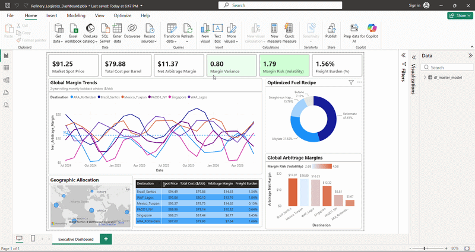

# Refinery Supply Chain & Maritime Logistics Dashboard

An economic decision-support dashboard designed to track downstream refinery logistics and market economics. This project automates the extraction of market spot prices and logistics data via Python, models refinery gross margins using DAX, and visualizes dynamic route-profitability metrics across global destination markets.

---

## 📊 Live Dashboard Demonstration
*(Watch the dynamic cost allocation and risk heatmapping in action below)*

📄 **[Click here to view or download the high-resolution PDF export](assets/dashboard_Export.pdf)**

---

## Technical Scope

### 1. Data Engineering & Extraction
* Built an automated data pipeline using **Python (Pandas)** to extract and clean shifting market spot prices, freight costs, and maritime timelines.

### 2. Financial Modeling & Business Intelligence
* **Data Modeling:** Designed a robust star-schema relational model in **Power BI** to handle multi-component chemical blending data across geographic dimensions.
* **Advanced DAX:** Authored complex measures utilizing time-intelligence and statistical iterators (`STDEVX.S`) to model localized refinery margins, crack spreads, and directional risk.
* **Logistics Integration:** Paired Free-on-Board (FOB) refinery costs with variable freight burdens to output Cost, Insurance, and Freight (CIF) metrics.
